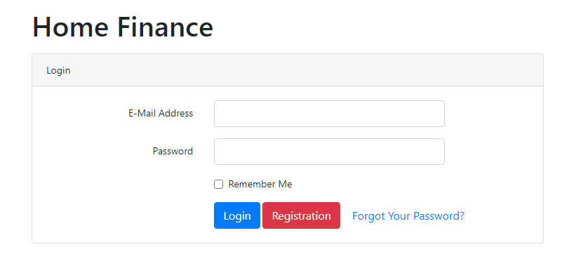
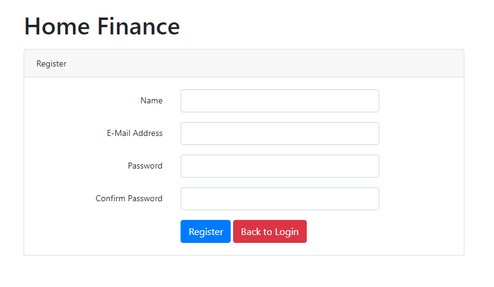
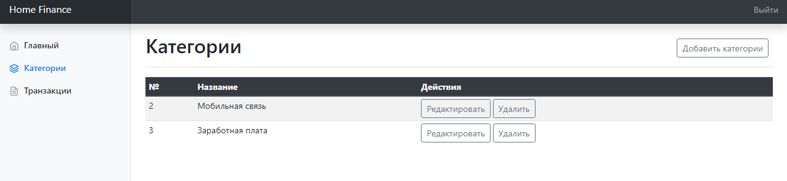
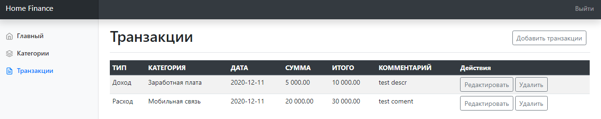
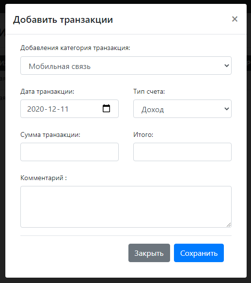

## Home Finance
##### Приложение для ведения учета домашнего бюджета

##### Используемые технологии:

- Php 7.4.6
- Laravel 7
- MySql
- Composer 1.10

#### Сборка проекта:

##### Для сборки нужен *Composer version 1.10.6* и выше

1. Клонируйте этот репозиторий на свой компьютер
```yaml
git clone https://github.com/NurbekMakhmudov/home-finance.git
```

2. Отредактируйте файл .env для своей базы данных

3. Запустите эту команду из терминала
```yaml
php artisan serve
```

#### Скриншоты приложения:

##### Страница авторизации:


##### Страница регистр:


##### Страница категории:


##### Страница транзакций:


##### Форма создания новой транзакции: 


## License

Это программное обеспечение с открытым исходным кодом под лицензией [MIT license](https://opensource.org/licenses/MIT).
